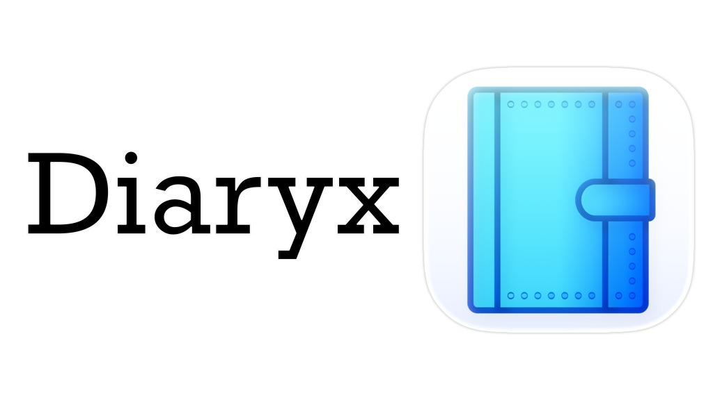

# Writing *is* connection.

That's the central point of Diaryx, and it's more revolutionary than it seems.

- [Read the specification](https://spec.diaryx.org)
- [Use the web app](https://app.diaryx.org)

## Write with purpose, and keep it forever.

Writing is the driver of human innovation, because it connects minds and hearts together. But in the digital age, we have failed to recognize what makes writing special. Put simply, writing has become cheap.

Diaryx takes the focus off of content and back on connection. It embeds metadata into the document itself, including information about the intended visibility of the document, enabling role-based access to your writing and radical portability.

In the future, Diaryx will provide persistent identifiers (PIDs) for your writing, built on the decentralized and battle-tested ARK framework, so you won't even need to use the Diaryx platform in order to own your writing for good.

## Project Status

Right now, Diaryx is in its infancy. Neither the writing specification nor the Diaryx software are ready for widespread use, but we are actively seeking feedback and support. Please email [contact@diaryx.org](mailto:contact@diaryx.org) if you have any feedback or help to offer!
